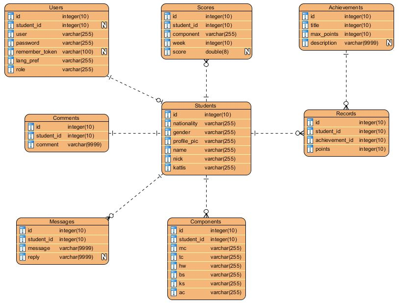

Ranklist - Lab 5
================
Hello, if you thought of something that need to done, but busy at the moment, create an issue! So that somebody who might find the problem doable/easy can get that job done instead!
Remember to describe the poblem and the definition of done as clearly as possible, just suggesting~ 

Database Structure
==================


Setup guide
===========
### XAMPP setup
Install XAMPP
```sh
https://www.apachefriends.org/index.html
```

### Clone the project into C:\xampp\htdocs\rankteam1
```sh
git clone https://github.com/dev-seahouse/cs3226Assignments.git
```

### Configure Virtual Host
Add the following code into C:\xampp\apache\conf\extra\httpd-vhosts.conf
```sh
<VirtualHost *:80>
    DocumentRoot "C:\xampp\htdocs\rankteam1\public"
    Errorlog "C:\xampp\htdocs\rankteam1\storage\logs\error.log"
    <Directory "C:\xampp\htdocs\rankteam1\public">
        Options Indexes FollowSymLinks 
        AllowOverride All 
        Require all granted         
    </Directory>
</VirtualHost>
```

### Setup Laravel
#### Setup requirements to install composer
Remove the semi-colon for the following values in C:\xampp\php\php.ini
```sh
extension=php_openssl.dll
extension=php_curl.dll
extension=php_sockets.dll
```
double check that there is only one uncommented line of "extension=php_openssl.dll"

#### Install Composer
1. Download and install Composer at https://getcomposer.org/download/
2. When asked to select command-line PHP, browse to C:\xampp\php\php.exe

#### Install Laravel
In the root folder of the project C:\xampp\htdocs\rankteam1
open command prompt and run the following commands:
```sh
# composer global require "laravel/installer"
# composer install
# composer require "laravelcollective/html":"^5.3.0"
```

#### Generate .env file
In the root folder of the project C:\xampp\htdocs\rankteam1
```sh
# php artisan config:clear
# copy .env.example .env
# php artisan key:generate
```
### Use the server's database for the project
Modify the following settings in C:\xampp\htdocs\rankteam1\\.env
```sh
DB_CONNECTION=mysql
DB_HOST=128.199.205.219
DB_PORT=3306
DB_DATABASE=ranklist
DB_USERNAME=developer
DB_PASSWORD=developerP@ssw0rd1
```
### Access the server's database through the web browser
Update the following variables in C:\xampp\phpMyAdmin\config.inc.php
```sh
$cfg['Servers'][$i]['auth_type'] = 'config';
$cfg['Servers'][$i]['user'] = 'developer';
$cfg['Servers'][$i]['password'] = 'developerP@ssw0rd1';
$cfg['Servers'][$i]['host'] = '128.199.205.219';
```
You should be able to access http://localhost/phpmyadmin without having to enter the credentials

To access http://128.199.205.219/phpmyadmin/<br>
<b>User:</b>&nbsp;&nbsp;&nbsp;&nbsp;&nbsp;&nbsp;&nbsp;&nbsp;&nbsp;&nbsp;developer<br>
<b>Password:</b>&nbsp;&nbsp;developerP@ssw0rd1<br>

